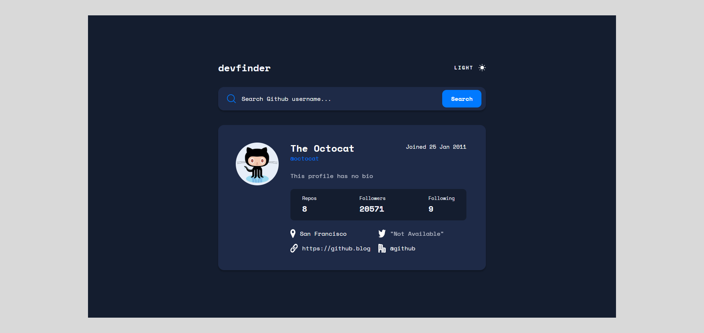

# Frontend Mentor - GitHub user search app solution

This is a solution to the [GitHub user search app challenge on Frontend Mentor](https://www.frontendmentor.io/challenges/github-user-search-app-Q09YOgaH6). Frontend Mentor challenges help you improve your coding skills by building realistic projects.

## Table of contents

-   [Overview](#overview)
    -   [The challenge](#the-challenge)
    -   [Screenshot](#screenshot)
    -   [Links](#links)
-   [My process](#my-process)
    -   [Built with](#built-with)
    -   [What I learned](#what-i-learned)
    -   [Continued development](#continued-development)
    -   [Useful resources](#useful-resources)
-   [Author](#author)

## Overview

### The challenge

Users should be able to:

-   View the optimal layout for the app depending on their device's screen size
-   See hover states for all interactive elements on the page
-   Search for GitHub users by their username
-   See relevant user information based on their search
-   Switch between light and dark themes
-   **Bonus**: Have the correct color scheme chosen for them based on their computer preferences. _Hint_: Research `prefers-color-scheme` in CSS.

### Screenshot

### Links

-   Solution URL: [Github](https://github.com/Jojo25011990/github-api)
-   Live Site URL: [Github Pages](https://jojo25011990.github.io/github-api)

## My process

### Built with

-   Semantic HTML5 markup
-   CSS custom properties
-   Flexbox
-   CSS Grid
-   TailwindCSS
-   Desktop-first workflow
-   [React](https://reactjs.org/) - JS library
-   [Next.js](https://nextjs.org/) - React framework

## Author

-   Frontend Mentor - [Jojo25011990](https://www.frontendmentor.io/profile/Jojo25011990)
-   Instagram - [web.animations.and.effects](https://www.instagram.com/web.animations.and.effects)
-   Tiktok - [web.anim.and.effects](https://www.tiktok.com/@web.anim.and.effects)
-   Youtube - [web.animations.and.effects](https://www.youtube.com/@web.animations.and.effects)
-   Linkedin - [Jozef Kudrna](https://www.linkedin.com/in/jozef-kudrna-28b580295)
-   CssBattle - [Jozef Kudrna](https://cssbattle.dev/player/MKRJOhBaKyenooWkH27VsZc2z0l2)
